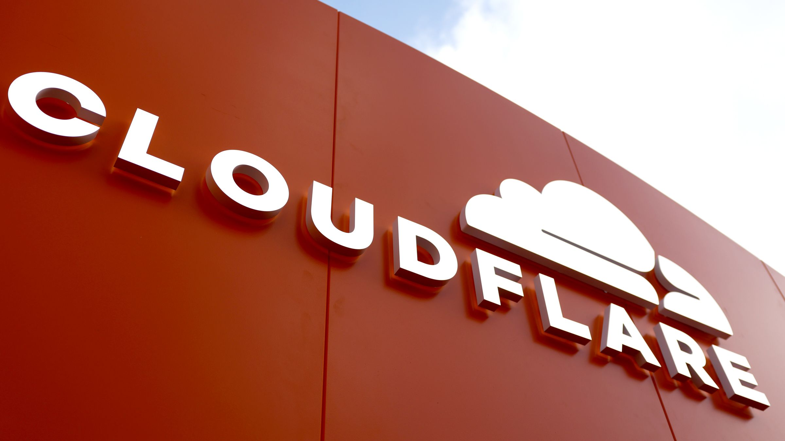
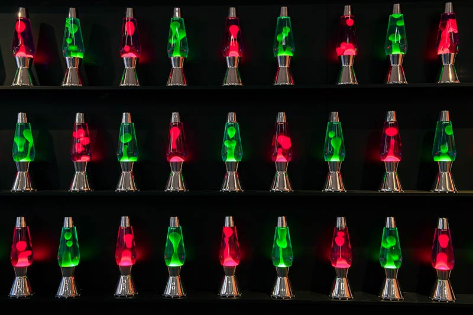

# Cloudflare Learning



A hands-on journey through Cloudflare's ecosystem — from DNS basics to building full-stack serverless applications with Workers, Durable Objects, and Zero Trust security.

## Quick Start

```bash
# Clone the repo
git clone <your-repo-url>
cd cloudflare-learning

# Install Wrangler globally (optional)
npm install -g wrangler

# Login to Cloudflare
npx wrangler login

# Start with the first project
cd projects/00-hello-worker
npm install
npm run dev
```

## Repository Structure

```
cloudflare-learning/
├── projects/
│   │
│   │  # Beginner — Single service, one storage type
│   ├── 00-hello-worker/           # Just Workers
│   ├── 01-url-shortener/          # Workers + KV
│   ├── 02-redirect-engine/        # Workers + KV + bulk operations
│   ├── 03-contact-form/           # Workers + Email Workers
│   │
│   │  # Intermediate — Multiple services, mixed storage
│   ├── 04-link-in-bio/            # Pages + D1 + Workers
│   ├── 05-image-cdn/              # Workers + R2 + caching
│   ├── 06-api-gateway/            # Workers + KV + D1 + rate limiting
│   ├── 07-webhook-relay/          # Workers + Queues
│   │
│   │  # Advanced — Full stack, real-time, coordination
│   ├── 08-realtime-chat/          # Durable Objects + WebSockets + D1
│   ├── 09-edge-auth-system/       # Workers + DO + KV + JWT
│   ├── 10-ai-search/              # Workers AI + Vectorize + D1
│   └── 11-multi-tenant-saas/      # Full stack (all services)
│
├── notes/
│   ├── concepts.md                # Core concepts reference
│   └── roadmap.md                 # Learning roadmap & curriculum
│
└── README.md
```

## Projects Overview

### Beginner (00-03)

| # | Project | Stack | What You'll Learn |
|---|---------|-------|-------------------|
| 00 | [Hello Worker](projects/00-hello-worker/) | Workers | Wrangler CLI, fetch handler, request/response basics, routing |
| 01 | [URL Shortener](projects/01-url-shortener/) | Workers + KV | KV read/write, redirects, nanoid generation, analytics |
| 02 | [Redirect Engine](projects/02-redirect-engine/) | Workers + KV | Bulk operations, pattern matching, API design, admin endpoints |
| 03 | [Contact Form](projects/03-contact-form/) | Workers + Email | MailChannels, form validation, spam protection, HTML responses |

### Intermediate (04-07)

| # | Project | Stack | What You'll Learn |
|---|---------|-------|-------------------|
| 04 | [Link in Bio](projects/04-link-in-bio/) | Pages + D1 | D1 SQL queries, dynamic pages, click analytics, profile management |
| 05 | [Image CDN](projects/05-image-cdn/) | Workers + R2 | R2 storage, presigned URLs, image transforms, cache headers |
| 06 | [API Gateway](projects/06-api-gateway/) | Workers + KV + D1 | Rate limiting, API key auth, request proxying, metrics logging |
| 07 | [Webhook Relay](projects/07-webhook-relay/) | Workers + Queues | Async processing, HMAC signatures, retries, delivery tracking |

### Advanced (08-11)

| # | Project | Stack | What You'll Learn |
|---|---------|-------|-------------------|
| 08 | [Real-time Chat](projects/08-realtime-chat/) | DO + WebSockets + D1 | Durable Objects, WebSocket hibernation, presence, message persistence |
| 09 | [Edge Auth](projects/09-edge-auth-system/) | Workers + DO + KV | JWT at edge, password hashing, sessions, RBAC, refresh tokens |
| 10 | [AI Search](projects/10-ai-search/) | Workers AI + Vectorize | Embeddings, vector search, RAG patterns, hybrid search |
| 11 | [Multi-tenant SaaS](projects/11-multi-tenant-saas/) | Full Stack | All services combined, teams, billing, production patterns |

## Prerequisites

- [Node.js](https://nodejs.org/) 18+
- [Cloudflare account](https://dash.cloudflare.com/sign-up) (free tier works for most projects)
- Basic TypeScript knowledge

## Getting Started

Each project is self-contained with its own README. Follow this order:

1. **Read the concepts** — Start with [notes/concepts.md](notes/concepts.md) to understand the fundamentals
2. **Follow the roadmap** — See [notes/roadmap.md](notes/roadmap.md) for the complete learning path with milestones
3. **Build projects sequentially** — Each project builds on skills from previous ones

### Project Structure

Every project includes:

```
project-name/
├── src/
│   └── index.ts          # Main worker entry point
├── wrangler.toml         # Cloudflare configuration
├── package.json          # Dependencies and scripts
├── tsconfig.json         # TypeScript config
├── schema.sql            # Database schema (if using D1)
└── README.md             # Project-specific instructions
```

### Common Commands

```bash
# Development
npm run dev              # Start local dev server
npm run deploy           # Deploy to Cloudflare

# Wrangler CLI
npx wrangler login       # Authenticate
npx wrangler tail        # Stream live logs
npx wrangler secret put  # Add secrets

# KV
npx wrangler kv:namespace create MY_KV
npx wrangler kv:key put --binding MY_KV "key" "value"

# R2
npx wrangler r2 bucket create my-bucket

# D1
npx wrangler d1 create my-database
npx wrangler d1 execute my-database --file=schema.sql
```

## Learning Path



### Level 1: Foundations
- DNS & CDN configuration
- SSL/TLS modes
- Caching strategies
- WAF basics
- First Worker deployment

### Level 2: Workers Deep Dive
- Request/response handling
- Routing patterns
- Middleware composition
- Error handling

### Level 3: Storage Primitives
- KV for config and sessions
- R2 for file storage
- D1 for relational data
- Durable Objects for state

### Level 4: Zero Trust & Security
- Cloudflare Tunnel
- Access policies
- Gateway rules
- Advanced WAF

### Level 5: Advanced Patterns
- Queues & Crons
- WebSockets
- Workers AI
- Service bindings

## Resources

### Official Documentation
- [Workers Docs](https://developers.cloudflare.com/workers/)
- [D1 Docs](https://developers.cloudflare.com/d1/)
- [R2 Docs](https://developers.cloudflare.com/r2/)
- [Durable Objects Docs](https://developers.cloudflare.com/durable-objects/)
- [Zero Trust Docs](https://developers.cloudflare.com/cloudflare-one/)

### Community
- [Cloudflare Discord](https://discord.gg/cloudflaredev)
- [Cloudflare Blog](https://blog.cloudflare.com/)
- [Workers Examples](https://github.com/cloudflare/workers-sdk/tree/main/templates)

## Progress Tracker

Track your progress as you complete each project:

- [ ] **Beginner Projects**
  - [ ] 00 - Hello Worker
  - [ ] 01 - URL Shortener
  - [ ] 02 - Redirect Engine
  - [ ] 03 - Contact Form
- [ ] **Intermediate Projects**
  - [ ] 04 - Link in Bio
  - [ ] 05 - Image CDN
  - [ ] 06 - API Gateway
  - [ ] 07 - Webhook Relay
- [ ] **Advanced Projects**
  - [ ] 08 - Real-time Chat
  - [ ] 09 - Edge Auth System
  - [ ] 10 - AI Search
  - [ ] 11 - Multi-tenant SaaS

## License

MIT
